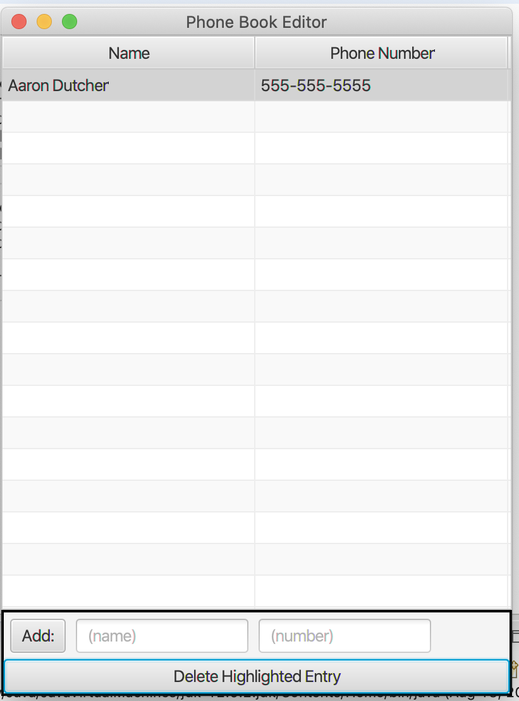

# PhonebookGUI
This is your basic phonebook that stores names and numbers.
The phonebook will allow you to go back and edit names and numbers also.

# How to Compile:
Download Project as zip

If you are useing a windows computer then your have you just copy the src folder.

If you are useing a Mac then you have to extract the MemoryTester folder and then copy the path

# link to my YouTube
This is the YouTube link to my project decribing the code.
